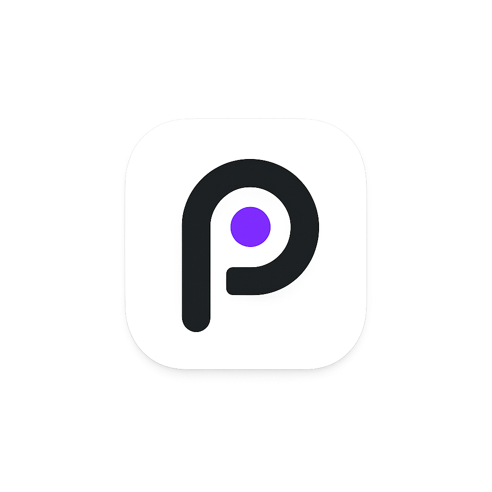
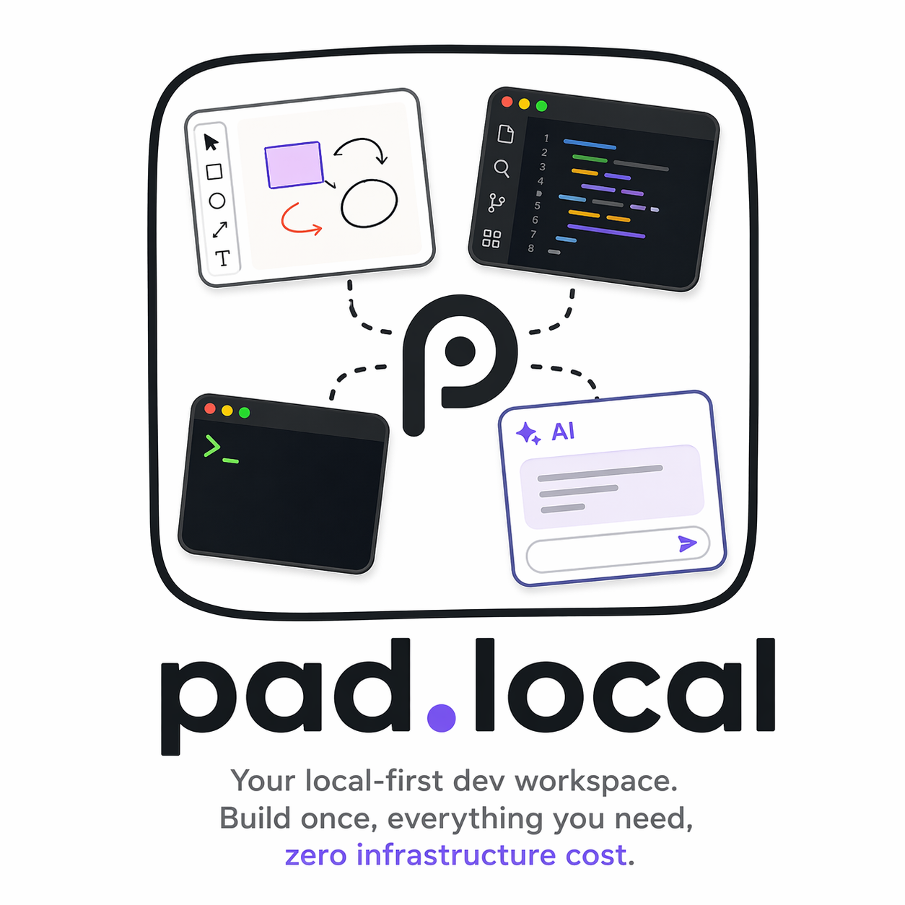
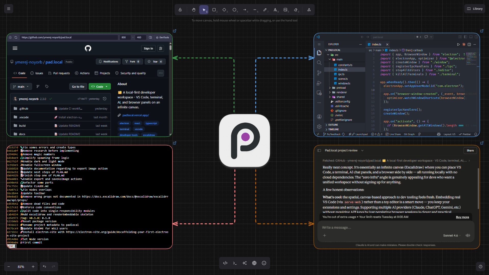

# pad.local

[](https://nodejs.org)
[](https://www.electronjs.org)
[](https://github.com/ymerej-noyorb/pad.local)
[](LICENSE)
[](https://padlocal.vercel.app)

> Your local-first dev workspace. Build once, everything you need, zero infrastructure cost.

pad.local is a desktop app inspired by [pad.ws](https://github.com/coderamp-labs/pad.ws), stripped down to its essence: a whiteboard, a code editor, a terminal, an AI panel, and a browser — all in one window, running entirely on your machine.

Open source. No cloud. No auth. No database.

---

## What's inside

| Panel          | Tech                                                                                                            |
| -------------- | --------------------------------------------------------------------------------------------------------------- |
| 🎨 Whiteboard  | Excalidraw — the canvas everything lives in                                                                     |
| 💻 Code editor | VS Code, Cursor, Windsurf, or VSCodium (`serve-web`) — your extensions, your settings                           |
| 🖥️ Terminal    | xterm.js + node-pty                                                                                             |
| 🤖 AI          | Claude, ChatGPT, Gemini, Copilot, Perplexity, Mistral                                                           |
| 🌐 Browser     | Embedded webview with address bar, device presets (Firefox list + custom sizes), touch simulation, and DevTools |

All panels live as nodes inside the Excalidraw canvas — drag them anywhere, resize them, draw around them. Any panel can go fullscreen with F11 (Windows / Linux) or Ctrl+Cmd+F (macOS) — Escape to exit.





---

## Getting started

### Prerequisites

**Node.js 20.19+** (22 LTS or 24 LTS recommended — minimum imposed by Vite 7) and at least one of **VS Code**, **Cursor**, **Windsurf**, or **VSCodium** installed and available in your `PATH`.

Supported platforms: macOS, Windows, Linux. **WSL is not supported** — VS Code's CLI in WSL is a remote wrapper that does not expose `serve-web`.

#### Install Node.js — macOS

Using [nvm](https://github.com/nvm-sh/nvm) (recommended):

```bash
curl -o- https://raw.githubusercontent.com/nvm-sh/nvm/v0.40.3/install.sh | bash
# restart your terminal, then:
nvm install 24
nvm use 24
```

Or using Homebrew: `brew install node@24`

#### Install Node.js — Windows

Using [nvm-windows](https://github.com/coreybutler/nvm-windows/releases) (recommended) — download the installer, then:

```powershell
nvm install 24
nvm use 24
```

Or download the official **v24 LTS** installer from [nodejs.org](https://nodejs.org).

> Install Node.js in native Windows, not inside WSL.

#### Install Node.js — Linux

Using [nvm](https://github.com/nvm-sh/nvm) (recommended):

```bash
curl -o- https://raw.githubusercontent.com/nvm-sh/nvm/v0.40.3/install.sh | bash
# restart your terminal, then:
nvm install 24
nvm use 24
```

Or via NodeSource (Ubuntu / Debian):

```bash
curl -fsSL https://deb.nodesource.com/setup_24.x | sudo -E bash -
sudo apt-get install -y nodejs
```

### Run

```bash
git clone https://github.com/ymerej-noyorb/pad.local
cd pad.local
npm install
npm run dev
```

---

## Building for distribution

### macOS — produces a `.dmg`

```bash
npm run build:mac
```

Output: `dist/pad.local.dmg`.

### Windows — produces a `.exe` installer

```bash
npm run build:win
```

Output: `dist/pad.local-setup.exe` (NSIS installer). No administrator rights required.

### Linux — produces an `.AppImage` and a `.deb`

```bash
npm run build:linux
```

Outputs: `dist/pad.local.AppImage` and a `.deb` package. To run the AppImage directly — no installation needed:

```bash
chmod +x dist/pad.local.AppImage
./dist/pad.local.AppImage
```

---

## Stack

- **[Electron](https://www.electronjs.org/)** — Desktop shell
- **[React](https://react.dev/) + TypeScript** — UI
- **[electron-vite](https://electron-vite.org/)** — Build tooling
- **[Excalidraw](https://github.com/excalidraw/excalidraw)** — Fullscreen canvas
- **[VS Code](https://code.visualstudio.com/)** (or Cursor, Windsurf, VSCodium) — Editor, served via `serve-web`
- **[xterm.js](https://xtermjs.org/) + [node-pty](https://github.com/microsoft/node-pty)** — Terminal

---

## How it works

When you launch pad.local, Electron loads Excalidraw fullscreen. From there:

- **New editor** → a picker lists the VS Code forks detected on your machine (VS Code, Cursor, Windsurf, VSCodium) → selecting one spawns its `serve-web` server on demand and embeds it as a canvas node
- **New terminal** → a picker lists the shells detected on your OS → selecting one spawns a PTY and embeds it as a canvas node
- **New AI** → a picker lists all supported AI providers → selecting one opens the provider's web interface in a webview node, authenticated via your own session (no API key needed)
- **New browser** → a blank browser node appears instantly with an address bar — type a URL and hit Enter to load it; pick a device from the preset dropdown (full Firefox device list + custom sizes) to resize the node instantly; enable touch simulation for phone/tablet presets to test touch interactions; open the embedded DevTools to inspect the page

Each Editor node runs an independent server on its own port. Multiple editors, terminals, AI panels, and browser nodes of different types can coexist on the same canvas. Each AI provider keeps its own isolated session — you stay logged in across restarts.

Everything runs locally. Nothing leaves your machine.

---

## Persistence

- Excalidraw scene (elements, positions, zoom level) → saved as a local JSON file
- Terminal working directory → restored on next launch (zsh and fish only via OSC 7)
- Editor last opened folder/workspace → restored on next launch
- AI sessions → persistent per provider (you stay logged in across restarts)
- Browser custom device sizes → persisted in localStorage (available across restarts)
- Editor / terminal → your actual filesystem, no abstraction

---

## Design principles

- **Local first** — works offline, always
- **Zero infra** — no server, no database, no auth
- **Your editor, your rules** — your extensions, your keybindings, your themes — pad.local embeds the editor you already use, unchanged

---

## Known limitations

- **WSL not supported** — VS Code's CLI in WSL is a remote wrapper that does not expose `serve-web`.
- **Supported editors: VS Code forks only** — The Editor panel works by embedding a local HTTP server (`serve-web`) in a webview. Only VS Code, Cursor, Windsurf, and VSCodium support this. JetBrains IDEs and Zed have no equivalent; terminal-based editors (Neovim, Vim, Helix…) work via the Terminal panel instead.
- **VS Code 1.119.0 breaks serve-web** — A regression in VS Code 1.119.0 ([issue #315003](https://github.com/microsoft/vscode/issues/315003)) prevents the extension host from connecting, causing an endless "Time limit reached" error. Stay on **VS Code ≤ 1.118.x** until a patch is released. Disable auto-updates (`File > Preferences > Settings` → search `update mode` → set to `manual`). To roll back: download the [1.118.0 installer](https://update.code.visualstudio.com/1.118.0/win32-x64-user/stable) and reinstall over the existing installation — your extensions and settings are preserved.
- **Security warnings on first launch** — The distributed binaries are not code-signed. On Windows, SmartScreen will warn you ("Windows protected your PC") — click _More info → Run anyway_ to proceed. On macOS, Gatekeeper will block the app on first open — go to _System Settings → Privacy & Security_ and click _Open Anyway_. This is expected for an unsigned open-source app.

---

## Inspired by

[pad.ws](https://github.com/coderamp-labs/pad.ws) — great concept, now abandoned (last commit Aug 2025, site down). pad.local is the "just run it" version — and adds an AI panel that pad.ws never had.

[ai-assistant-electron](https://github.com/Andaroth/ai-assistant-electron) — inspired the `partition="persist:ai-<providerId>"` pattern for isolated per-provider cookie stores in the AI panel.

---

## License

[MIT](LICENSE)
